# 🔧 Bengkel Pakistunes - Mobile Workshop Management System


Aplikasi mobile lengkap untuk manajemen bengkel motor dengan fitur e-commerce, booking service, dan admin dashboard.

## 📱 Live Demo

- **Web App**: [https://bengkels.web.app](https://bengkels.web.app)
- **APK Download**: `build/app/outputs/flutter-apk/app-release.apk`

## 🎯 Overview

Bengkel Pakistunes adalah aplikasi all-in-one untuk bengkel motor yang menggabungkan:
- 🛒 E-commerce untuk pembelian sparepart
- 📅 Sistem booking service motor
- 💳 Payment confirmation system
- ⭐ Review & rating system
- 👤 User profile management
- 🔧 Admin dashboard

---

## ✨ Features

### 👥 **User Features**

#### 1. **Authentication**
- ✅ Email & Password login
- ✅ User registration with validation
- ✅ Role-based access control (User/Admin)
- ✅ Firebase Authentication integration
- ✅ Splash screen dengan logo branding

#### 2. **E-Commerce (Product Shopping)**
- ✅ Browse produk sparepart dengan grid layout
- ✅ Search & filter produk
- ✅ Product detail dengan gambar, harga, stok
- ✅ Shopping cart system
- ✅ Wishlist/Favorite produk
- ✅ Multiple address management
- ✅ Checkout process
- ✅ Payment confirmation dengan upload bukti transfer

#### 3. **Service Booking**
- ✅ Browse layanan service bengkel
- ✅ Booking service dengan pilih tanggal
- ✅ Time slot booking (08:00 - 17:00, setiap jam)
- ✅ Validasi slot yang sudah dibooking
- ✅ Booking history
- ✅ Status tracking (Pending → Confirmed → Processing → Done)

#### 4. **Order Management**
- ✅ Order history dengan filter status
- ✅ Order detail view
- ✅ Order status tracking
- ✅ Order cancellation (untuk status pending)
- ✅ Real-time order updates
- ✅ Notifikasi order status

#### 5. **Profile & Settings**
- ✅ View & edit profile
- ✅ Manage alamat pengiriman
- ✅ Order statistics dashboard
- ✅ Wishlist management
- ✅ Help center
- ✅ About app information

#### 6. **Review System**
- ✅ Review & rating per produk
- ✅ View all reviews
- ✅ Average rating display
- ✅ User review management

---

### 🔧 **Admin Features**

#### 1. **Dashboard**
- ✅ Overview statistics (orders, bookings, revenue)
- ✅ Recent orders & bookings
- ✅ Quick access menu
- ✅ Real-time data updates

#### 2. **Product Management**
- ✅ Add/Edit/Delete products
- ✅ Upload product images (Firebase Storage)
- ✅ Stock management
- ✅ Price & category management
- ✅ Product availability toggle

#### 3. **Order Management**
- ✅ View all orders
- ✅ Update order status (Pending → Processing → Shipping → Done)
- ✅ Cancel orders
- ✅ View order details & customer info
- ✅ Payment proof verification

#### 4. **Booking Management**
- ✅ View all service bookings
- ✅ Update booking status
- ✅ Time slot view
- ✅ Customer information access

#### 5. **Service Management**
- ✅ Add/Edit/Delete services
- ✅ Service pricing
- ✅ Duration management
- ✅ Service description

---

## 🛠️ Technology Stack

### **Frontend**
- **Framework**: Flutter 3.10.7
- **Language**: Dart
- **State Management**: Provider
- **UI Components**: Material Design 3

### **Backend & Services**
- **BaaS**: Firebase
  - 🔐 Firebase Authentication
  - 🗄️ Cloud Firestore (Database)
  - 📦 Firebase Storage (Images)
  - 🚀 Firebase Hosting (Web deployment)
  - 📱 Firebase Cloud Messaging (Notifications)

### **Additional Packages**
```yaml
dependencies:
  firebase_core: ^4.3.0
  firebase_auth: ^6.1.3
  cloud_firestore: ^6.1.1
  firebase_storage: ^13.0.5
  firebase_messaging: ^16.1.1
  provider: ^6.1.5+1
  intl: ^0.19.0
  image_picker: ^1.0.7
```

---

## 🔥 Firebase Integration

### **1. Authentication**
- Email/Password authentication
- User role management (admin/user)
- Session persistence
- Auto-login

### **Firestore Database Structure**

```
📦 Firestore Collections:
├── 👤 users
│   ├── uid
│   ├── email
│   ├── name
│   ├── phone
│   ├── role (admin/user)
│   └── createdAt
│
├── 🛍️ products
│   ├── name
│   ├── price
│   ├── stock
│   ├── category
│   ├── description
│   ├── imageUrl
│   ├── rating
│   └── reviewCount
│
├── 🛒 carts
│   ├── userId
│   ├── productId
│   ├── quantity
│   └── createdAt
│
├── 📦 orders
│   ├── userId
│   ├── items[]
│   ├── totalAmount
│   ├── status (pending/diproses/dikirim/selesai/dibatalkan)
│   ├── shippingAddress
│   ├── paymentProof
│   └── createdAt
│
├── 📅 bookings
│   ├── userId
│   ├── serviceId
│   ├── serviceName
│   ├── price
│   ├── date
│   ├── timeSlot
│   ├── status (pending/confirmed/diproses/selesai/dibatalkan)
│   └── createdAt
│
├── 🔧 services
│   ├── name
│   ├── price
│   ├── description
│   ├── duration
│   └── createdAt
│
├── ⭐ reviews
│   ├── userId
│   ├── productId
│   ├── rating (1-5)
│   ├── comment
│   └── createdAt
│
├── 💝 favorites
│   ├── userId
│   ├── productId
│   └── createdAt
│
├── 📍 addresses
│   ├── userId
│   ├── name
│   ├── phone
│   ├── address
│   ├── city
│   ├── province
│   ├── postalCode
│   └── isDefault
│
└── 🔔 notifications
    ├── userId
    ├── title
    ├── message
    ├── isRead
    └── createdAt
```

### **Security Rules**

**Firestore Rules:**
- User dapat read/write data sendiri
- Admin dapat akses semua data
- Product readable by all, writable by admin only
- Order & booking protected by user ownership

**Storage Rules:**
- User dapat upload payment proof
- Admin dapat upload product images
- File size limit & type validation

---

## 📸 Screenshots

### **User Interface**

<table>
  <tr>
    <td align="center">
      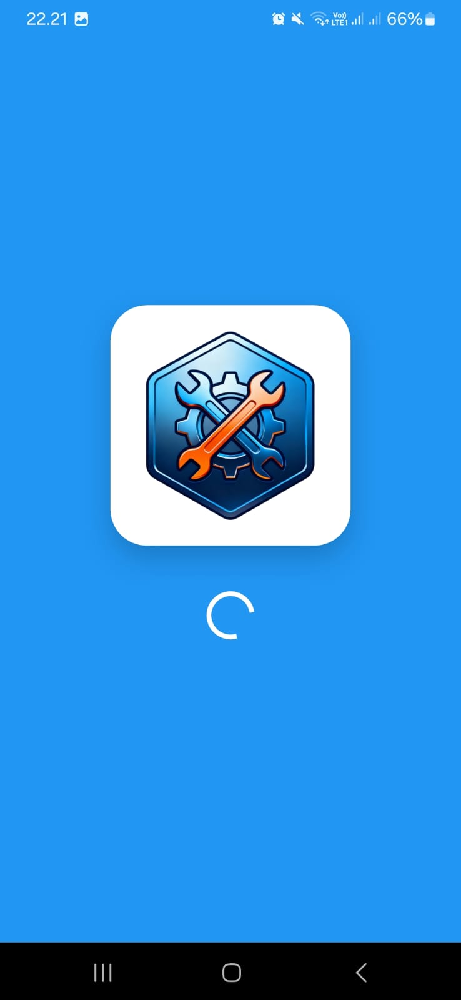<br/>
      <sub><b>Splash Screen</b></sub><br/>
      <sub>Logo branding Bengkel Pakistunes</sub>
    </td>
    <td align="center">
      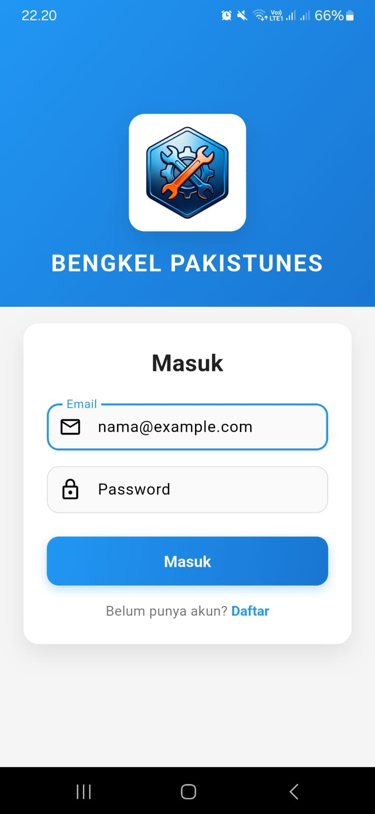<br/>
      <sub><b>Login Screen</b></sub><br/>
      <sub>Email & Password authentication</sub>
    </td>
    <td align="center">
      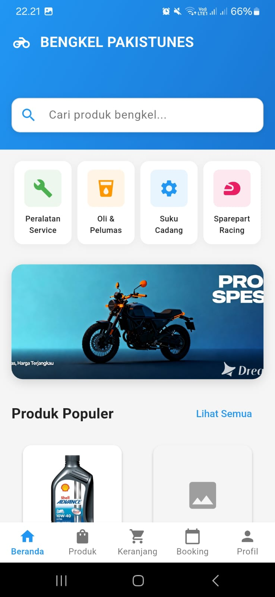<br/>
      <sub><b>Home Screen</b></sub><br/>
      <sub>Banner promo & product catalog</sub>
    </td>
  </tr>
</table>

### **E-Commerce Features**

<table>
  <tr>
    <td align="center">
      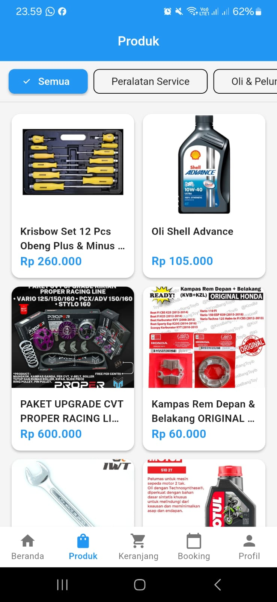<br/>
      <sub><b>Product List</b></sub><br/>
      <sub>Grid view dengan search & filter</sub>
    </td>
    <td align="center">
      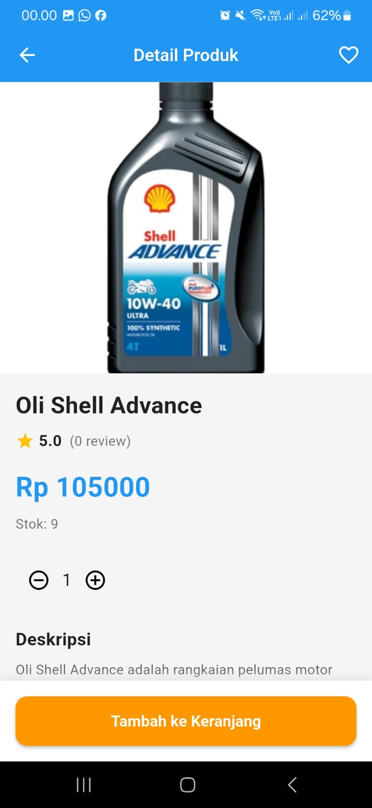<br/>
      <sub><b>Product Detail</b></sub><br/>
      <sub>Detail produk dengan stok & harga</sub>
    </td>
    <td align="center">
      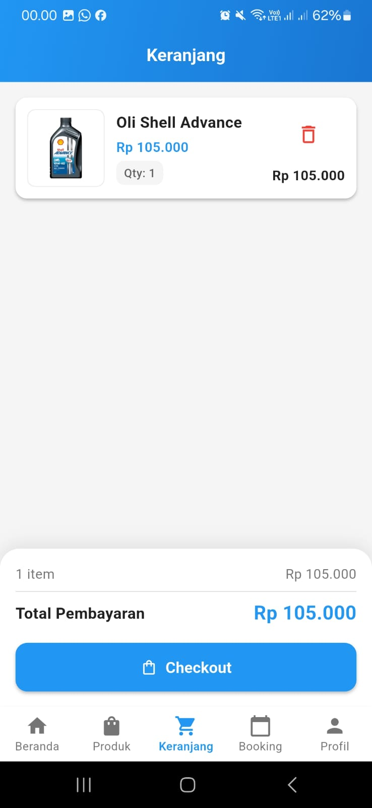<br/>
      <sub><b>Shopping Cart</b></sub><br/>
      <sub>Keranjang belanja dengan qty control</sub>
    </td>
  </tr>
  <tr>
    <td align="center">
      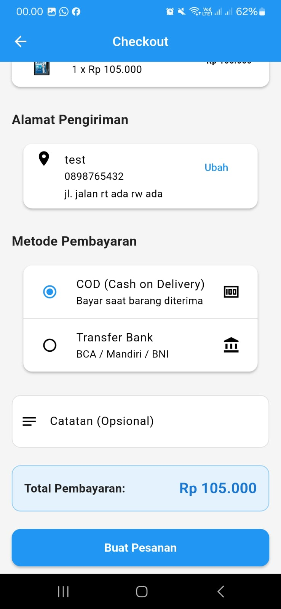<br/>
      <sub><b>Checkout</b></sub><br/>
      <sub>Form checkout dengan alamat</sub>
    </td>
    <td align="center">
      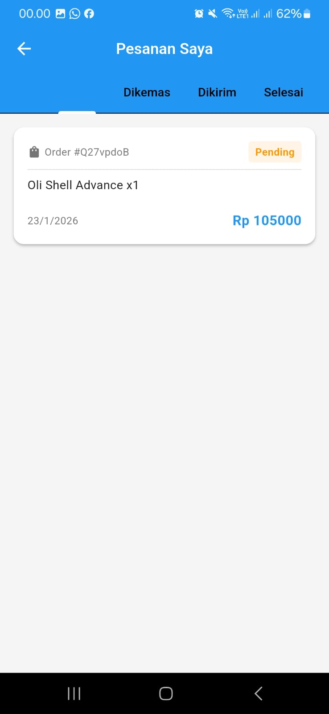<br/>
      <sub><b>Order History</b></sub><br/>
      <sub>Riwayat pesanan dengan filter status</sub>
    </td>
    <td align="center">
      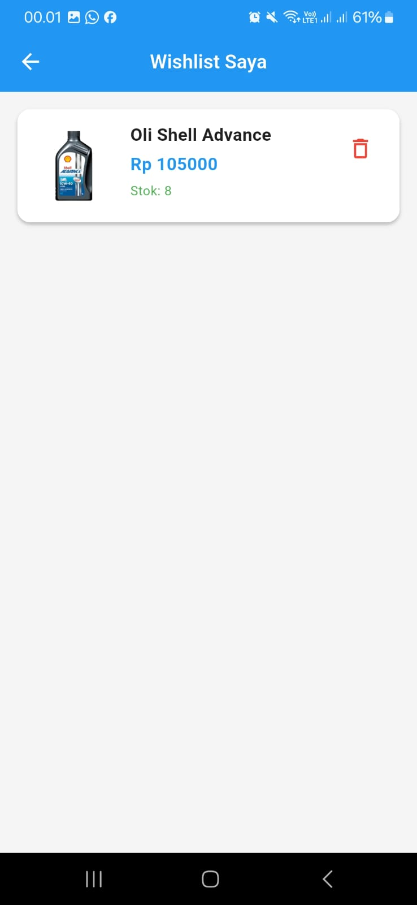<br/>
      <sub><b>Wishlist</b></sub><br/>
      <sub>Daftar produk favorit</sub>
    </td>
  </tr>
</table>

### **Service Booking**

<table>
  <tr>
    <td align="center">
      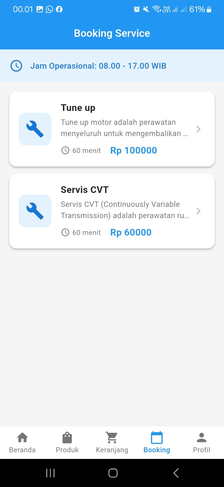<br/>
      <sub><b>Service List</b></sub><br/>
      <sub>Pilihan layanan service motor</sub>
    </td>
    <td align="center">
      <br/>
      <sub><b>Date Selection</b></sub><br/>
      <sub>Calendar untuk pilih tanggal booking</sub>
    </td>
    <td align="center">
      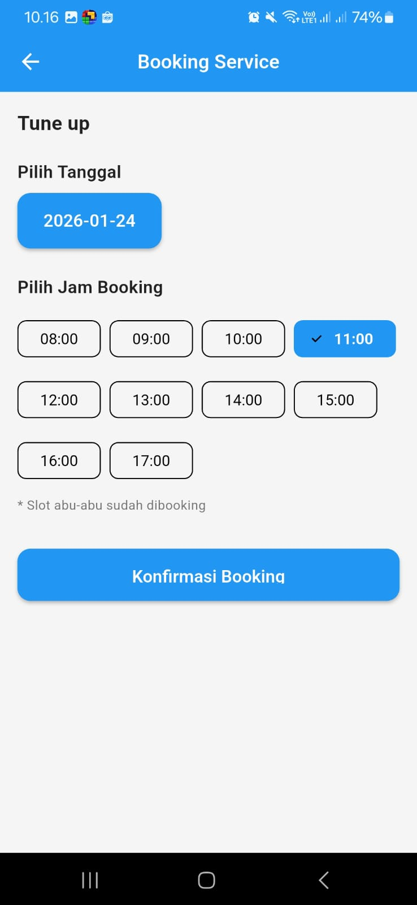<br/>
      <sub><b>Time Slot</b></sub><br/>
      <sub>Pilih jam booking (08:00-17:00)</sub>
    </td>
  </tr>
</table>

### **Profile & Settings**

<table>
  <tr>
    <td align="center">
      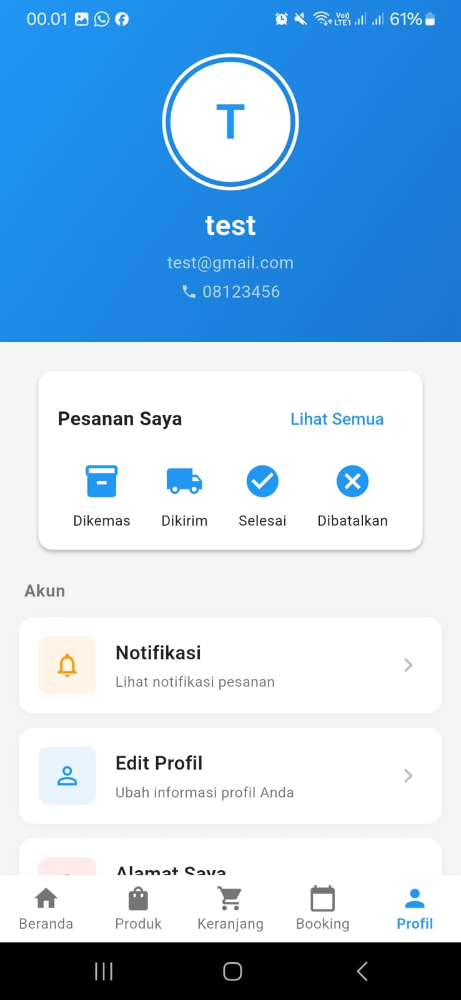<br/>
      <sub><b>Profile</b></sub><br/>
      <sub>User profile dengan menu</sub>
    </td>
    <td align="center">
      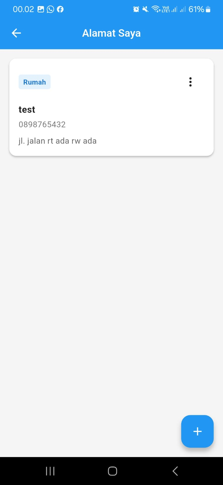<br/>
      <sub><b>Address Management</b></sub><br/>
      <sub>Kelola alamat pengiriman</sub>
    </td>
    <td align="center">
      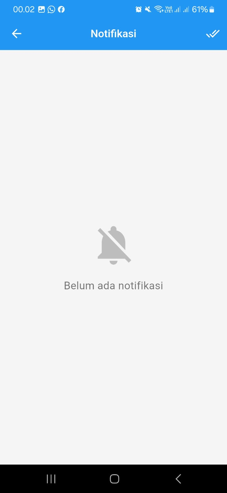<br/>
      <sub><b>Notifications</b></sub><br/>
      <sub>Notifikasi order & booking</sub>
    </td>
  </tr>
</table>

### **Admin Dashboard**

<table>
  <tr>
    <td align="center">
      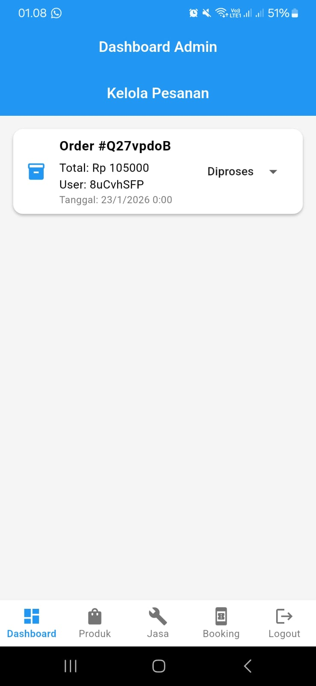<br/>
      <sub><b>Admin Dashboard</b></sub><br/>
      <sub>Statistics & overview</sub>
    </td>
    <td align="center">
      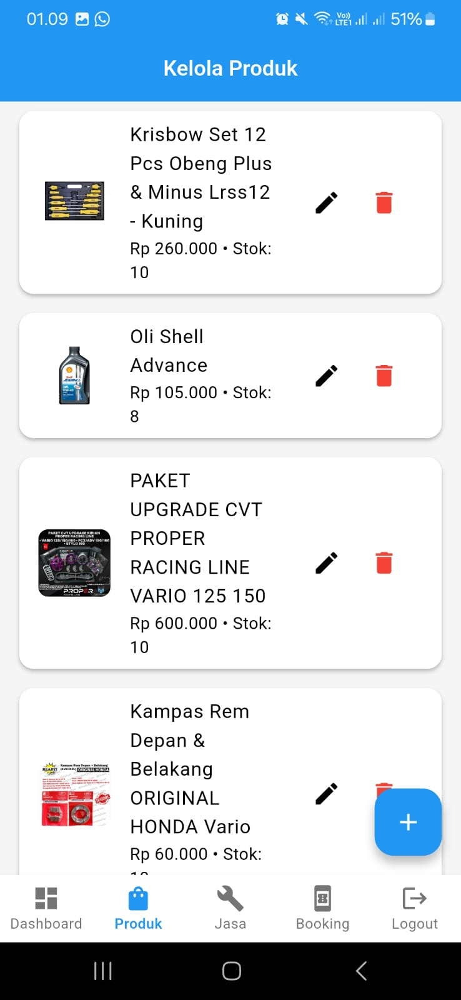<br/>
      <sub><b>Manage Products</b></sub><br/>
      <sub>CRUD produk dengan search</sub>
    </td>
    <td align="center">
      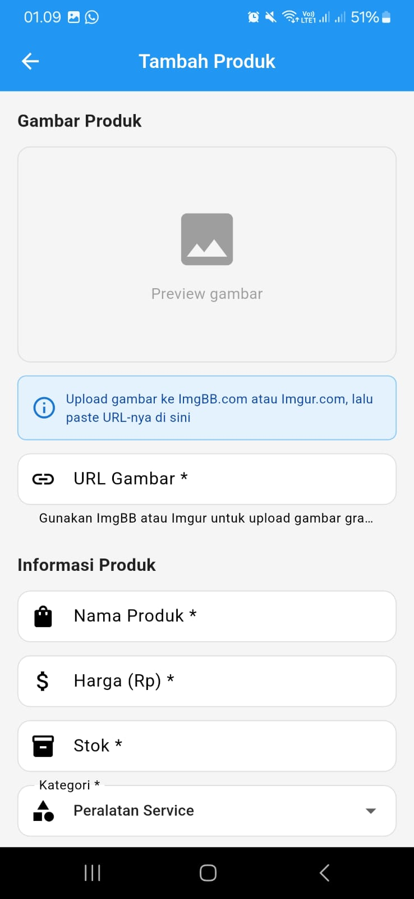<br/>
      <sub><b>Add Product</b></sub><br/>
      <sub>Form tambah produk dengan URL image</sub>
    </td>
  </tr>
  <tr>
    <td align="center">
      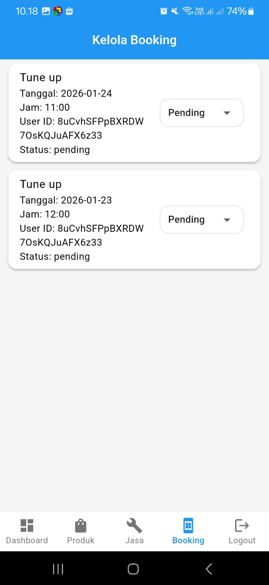<br/>
      <sub><b>Manage Bookings</b></sub><br/>
      <sub>Kelola semua booking service</sub>
    </td>
    <td align="center">
      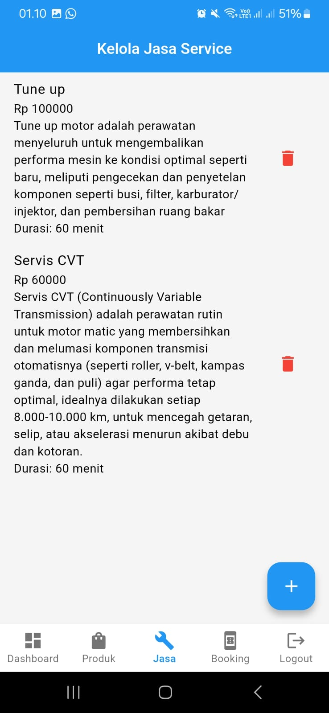<br/>
      <sub><b>Manage Services</b></sub><br/>
      <sub>CRUD layanan service</sub>
    </td>
    <td align="center">
      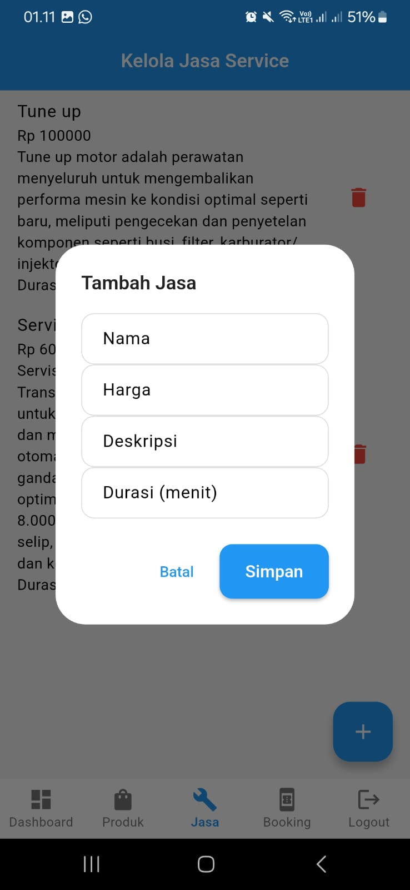<br/>
      <sub><b>Add Service</b></sub><br/>
      <sub>Form tambah service baru</sub>
    </td>
  </tr>
</table>

### **Firebase Integration**

<table>
  <tr>
    <td align="center">
      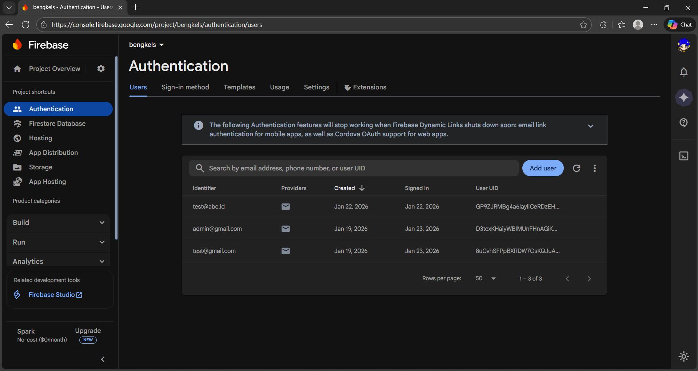<br/>
      <sub><b>Firebase Authentication</b></sub><br/>
      <sub>User management dengan Email/Password</sub>
    </td>
    <td align="center">
      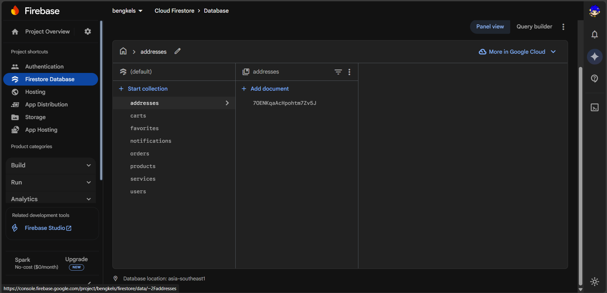<br/>
      <sub><b>Firestore Collections</b></sub><br/>
      <sub>Database structure: users, products, orders, bookings</sub>
    </td>
  </tr>
  <tr>
    <td align="center">
      <br/>
      <sub><b>Products Collection</b></sub><br/>
      <sub>Real-time product data dengan stock management</sub>
    </td>
    <td align="center">
      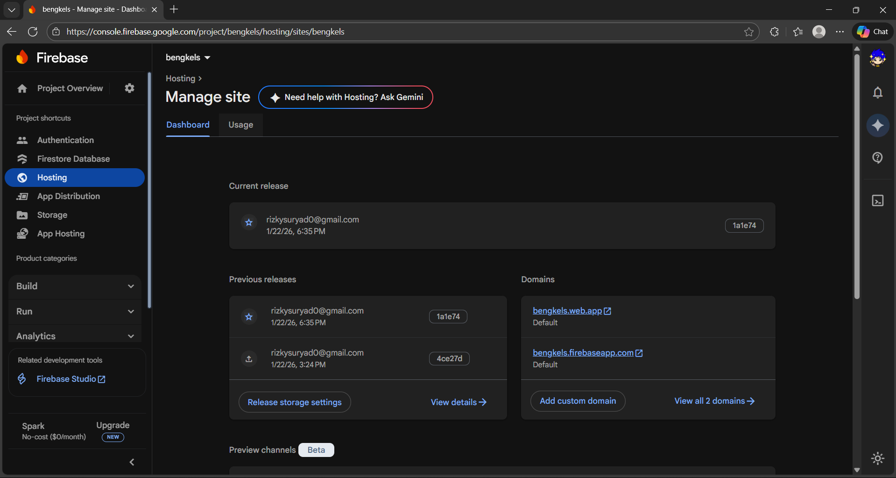<br/>
      <sub><b>Firebase Hosting</b></sub><br/>
      <sub>Web deployment: https://bengkels.web.app</sub>
    </td>
  </tr>
</table>

> **🎤 Panduan Presentasi (25 Slides)**: [docs/PRESENTASI.md](docs/PRESENTASI.md)

---

## 🚀 Installation
- ✅ Authentication (Email/Password)
- ✅ Firestore Database
- ✅ Firebase Storage
- ✅ Firebase Hosting (optional)


## 🔐 Default Accounts

### **Admin Account**
```
Email: admin@test.com
Password: admin123
Role: admin
```

### **User Account (Test)**
```
Email: user@test.com
Password: user123
Role: user
```

---

## 📂 Project Structure

```
lib/
├── main.dart                          
├── firebase_options.dart              
├── models/                           
│   ├── booking.dart
│   ├── product.dart
│   └── service_item.dart
├── screens/                         
│   ├── auth/                        
│   ├── admin/                    
│   ├── booking/                      
│   ├── order/                        
│   ├── product/                      
│   └── profile/                     
├── services/                         
│   ├── auth_service.dart
│   ├── booking_service.dart
│   └── catalog_service.dart
└── theme/                            
    └── app_theme.dart

assets/
└── images/
    ├── logo.png                     
    └── banner_promo.png              


## 📞 Support & Contact

- **Developer**: Bengkel Pakistunes Team
- **Email**: support@bengkelpakistunes.com
- **WhatsApp**: 0812-3456-7890
- **Website**: https://bengkels.web.app
- **Address**: Jl. Pakis Raya No. 123, Bandung, Jawa Barat


**Made with ❤️ using Flutter & Firebase**

